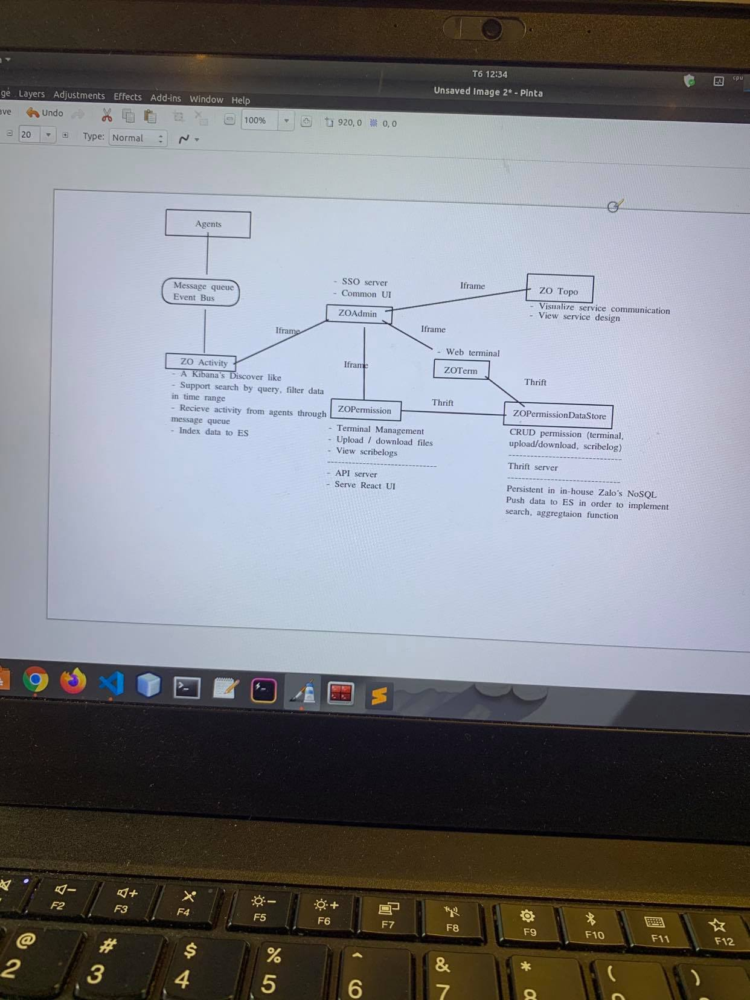

# Projects

## ZAHub

**Describe:** This a an Humae resources management system.

**Situation:** The current human resources management system is very old and does not meet the needs of the human resources department

**Action:**

Together with my line manager, We developed this human resource system that includes 2 parts:
1. The datastore: this is a Thrift server written in Java that manages all the data of the system on MySQL
2. Webapp part: includes an API Server written in Java and a UI written in React

In this project my boss just acts as a project manager and design consultant for me. Other parts related to technical such as database design, interface design, coding are mostly my responsibility.

## ZOAdmin

**Describe:** This is an operational platform for the engineering team

- SSO Server
- User Permission Management
- Activity Management

# What are your weeknesses?

**Perfectionism**

- Sometimes, during the development of some features that are no longer as meaningful as their original names, I tend to want to rename them even if it could affect the compatibility.

**Unfocused**

- Sometimes while I search for a solution to a problem I get wandered into something else that doesn't really help me solve the current problem.

**Carelessness**

- Sometimes, I don't have a very good attention to detail. While that's good because it lets me execute quickly, it also means that I sometimes make careless mistakes. Because of that, I make sure to always have someone else double check my work

# What questions should you ask the interviewer?

- When I joined the company, was I able to choose a team or was I already assigned a team? 
  - And will I join the team right after entering the company or after the probation?

- Can you tell me about the training schedule for new employees?
  - How long it lasts?
  - Who is the trainer?

- Can you describe for me a normal working day of a backend developer at LINE?

- As far as I know, the time zone in Korea is 2 hours faster than in Vietnam, is this a problem, and how do you solve this problem?

- Can you tell me about the salary review process?
  - How many times a year does it take place?
  - How a member is selected for salary review?
  - Who is the salary reviewer?

- How can I get on-site work in Korea or other countries?