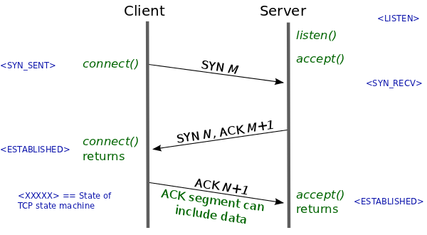
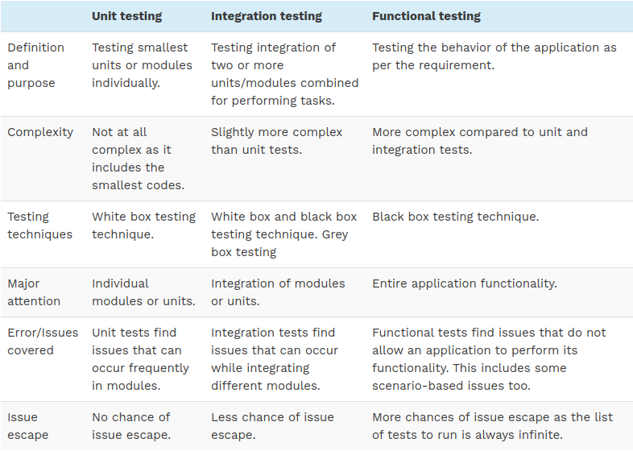
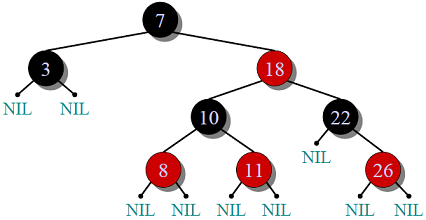
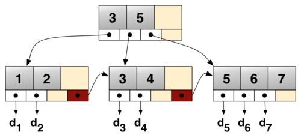
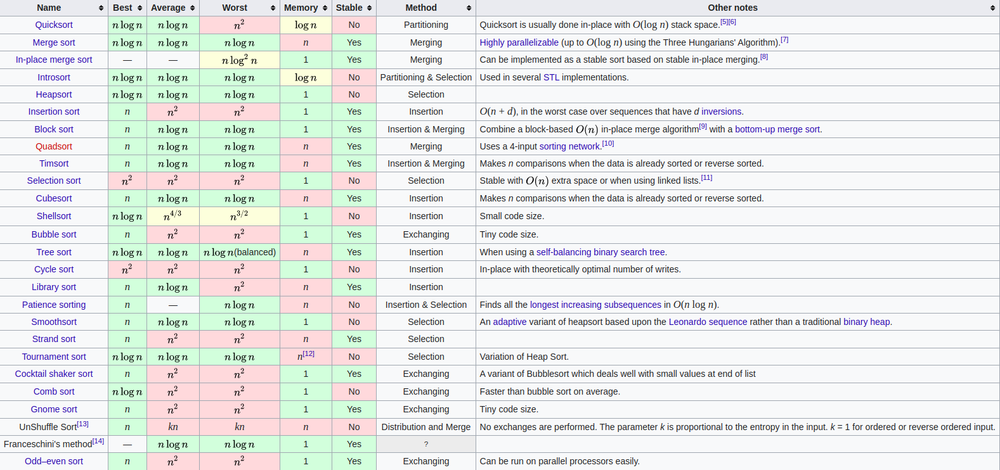
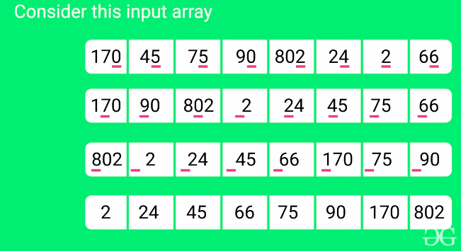
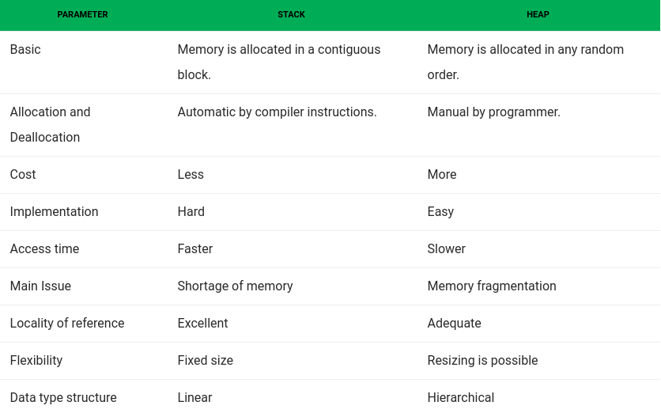
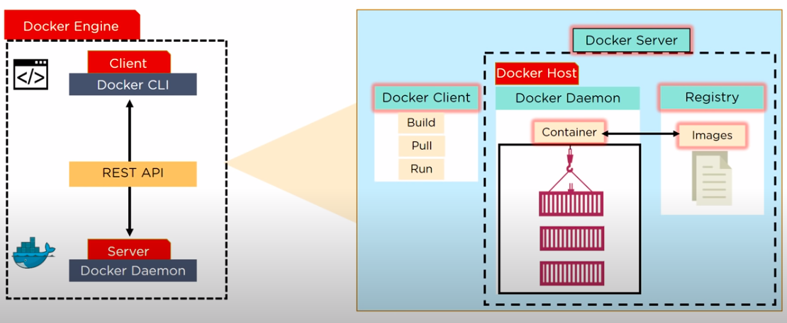
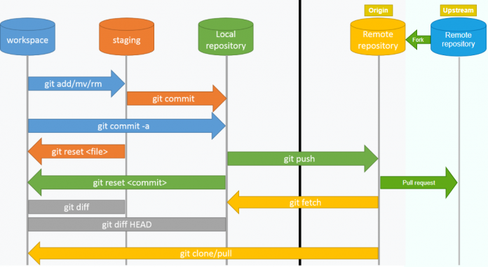

# Network

**HTTP**

Hyper text transfer protocol. At it’s most basic, it allows for the communication between different systems

Http versions:

- HTTP 0.9
  - Terminated immediately after the response
  - No Headers, No status code
  - Hypertext only
  - Methods support: `GET`
- HTTP 1.0
  - Support headers
  - Terminated immediately after the response
  - Methods support: `GET`, `POST` and `HEAD`
- HTTP 1.1
  - Persistent and pipelined connections
  - Chunked transfers
  - Compression / Decompression
  - Content negotiations
  - Virtual hosting
  - Methods support: `GET`, `POST`, `HEAD`, `PUT`, `DELETE`, `OPTIONS`
  - `Keep-Alive` header
  - `Upgrade` header
- HTTP 2.0
  - Multiplexing over single connection



**HTTPS**

Hypertext Transfer Protocol Secure (HTTPS) is an extension of the Hypertext Transfer Protocol (HTTP).

It is used for secure communication over a computer network, and is widely used on the Internet. 

In HTTPS, the communication protocol is encrypted using Transport Layer Security (TLS) or, formerly, Secure Sockets Layer (SSL). 

The protocol is therefore also referred to as HTTP over TLS, or HTTP over SSL.

This protocol secures communications by using what’s known as an asymmetric public key infrastructure. 

This type of security system uses two different keys to encrypt communications between two parties:

1. The private key - this key is controlled by the owner of a website and it’s kept, as the reader may have speculated, private. This key lives on a web server and is used to decrypt information encrypted by the public key.
2. The public key - this key is available to everyone who wants to interact with the server in a way that’s secure. Information that’s encrypted by the public key can only be decrypted by the private key.

**Headers**

**OSI Model**

- **Application layer:** Human-computer interaction layer, where applications can access the network services
  - End user layer
  - HTTP, FTP, SSH, DNS, IRC
  - Datas
- **Presentation layer:** Ensures that data is usable format and is where data encryption occurs
  - Syntax layer
  - SSL, SSH, IMAP, FTP, MPEG, JPEG
  - Datas
- **Session layer:** Maintains connections and is responsible for controlling ports and sessions
  - Sync & send to port
  - API's, Sockets, WinSock
  - Datas
- **Transport layer:** Transmits data using transmission protocols including TCP and UDP
  - End to end connections
  - TCP, UDP
  - Segments
- **Network layer:** Decides which physical path the data will take
  - IP, ICMP, IPSec, IGMP
  - Packets
- **Datalink layer:** Defines the format of data on the network
  - Ethernet, PPP, Switch, Bridge
  - MAC and LLC
  - Frames
- **Physical layer:** Transmits raw bit stream over the physical medium
  - Wireless, Hubs, Repeaters
  - Bits

**TCP/IP Model**

- **Application layer:** 
  - OSI Model: Application, Presentation and Session Layer
  - HTTP, FTTP, Telnet, NTP, DHCP, PING
- **Transport layer:**
  - OSI Model: Transport
  - TCP
  - UDP
- **Internet layer / Network layer:**
  - OSI Model: Network
  - IP, ARP, ICMP, IGMP
- **Network access layer:**
  - OSI Model: Data Link, Physical

**TCP**

- Transmission Control Protocol
- It is known to provide reliable and error-free communication between end systems. 
- It performs sequencing and segmentation of data. 
- It also has acknowledgment feature and controls the flow of the data through flow control mechanism. 
- It is a very effective protocol but has a lot of overhead due to such features. Increased overhead leads to increased cost.

**UDP**

- User Datagram Protocol
- On the other hand does not provide any such features. 
- It is the go-to protocol if your application does not require reliable transport as it is very cost-effective. 
- Unlike TCP, which is connection-oriented protocol, UDP is connectionless.

**FTP**

- File Transfer Protocol is a standard network protocol used for the transfer of computer files between a client and server on a computer network.

**SSH**

- Providing secure access for users and automated processes
- Interactive and automated file transfers
- Issuing remote commands
- Managing network infrastructure and other mission-critical system components.

**Polling / SSE / Websocket**

- **Short polling:** is an AJAX-based timer that calls at fixed delays
- **Long polling:** is based on Comet (i.e server will send data to the client when the server event happens with no delay)
  - Request with long or without timeout
  - Server hold request and repsonse when event happens
- **Websocket:** persistent connection between the client and server. This is a communications protocol providing full-duplex communication channels over a single TCP connection.
  - Frame-based not stream-based
  - Upgrade header
- **SSE:** is a mechanism that allows the server to asynchronously push the data to the client once the client-server connection is established. The server can then decide to send data whenever a new “chunk” of data is available. It can be considered as a one-way publish-subscribe model.
  - EventSource (HTML5)
  - The main benefits we get from this approach are:
    - Simpler implementation and Data efficiency
    - It is automatically multiplexed over HTTP/2 out of the box
    - Limits the number of connections for data on the client to one

**GET / POST**

GET | POST
----|-----
Values are visible in the URL | Values are not visible in the URL
GET has a limitation on the length of the values, generally 255 characters. | POST has no limitation on the length of the values since they are submitted via the body of HTTP.
GET performs are better compared to POST because of the simple nature of appending the values in the URL. | It has lower performance as compared to GET method because of time spent in including POST values in the HTTP body.
This method supports only string data types. | This method supports different data types, such as string, numeric, binary, etc.
GET results can be bookmarked. | 	POST results cannot be bookmarked.
GET request is often cacheable. | The POST request is hardly cacheable.
GET Parameters remain in web browser history. | Parameters are not saved in web browser history.

**Session-cookie**

- Session:
  - stored on server
  - usually is a map of data
- Cookie
  - stored on browser
  - http only (access only by server, javascript can't access http-only cookie)
  - secure (only send through https)
  - expired or persitent until close browser

**User agent**

- User agent is a string that contains application, operating system, platform, vendor and version informations of request

# Crypto

## Hash function

- Can't revert to plain data
- Only compare hash
- Some hash function:
  - MD5
  - Bcrypt
  - HMAC
    - SHA1
    - SHA2
    - SHA256
    - SHA512

## Encrypt function

- Synchronous: using one password
- Asynchronous: public key, private key
  - public key: share to every sender
  - private key: only the receiver
- Some encrypt function:
  - RSA: async
  - AES: sync

## Encode function

- No need key to encode
- Can revert to plain data by the same algorithm
- Some encode function:
  - Base64
  - URI

# Security

**XSS**

- Cross-site scripting
- The attacker aims to execute malicious scripts in a web browser of the victim by including malicious code in a legitimate web page or web application
- Prevent solution:
  - Don't trust user input
  - Avoid render plain HTML from user input data
  - Strip / Escaping HTML tag before render

**SQL Injection**

- The attacker aims to execute malicious SQL statements
- Attackers can use SQL Injection vulnerabilities to bypass application security measures.
- They can also use SQL Injection to add, modify, and delete records in the database.
- Prevent solution:
  - Don't trust user input
  - Using lastest SQL prepare statement library

# ElasticSearch

**How it work**

- ES retrieving and managing document-oriented and semi-structured data.
- The primary data structure ES uses is an inverted index managed using Apache Lucence's API
- Interted index is a mapping of each token to the list of documents containing that word, which makes it possible to locate documents with given keywords very quickly.
- Index information is stored in one or multiple partitions also called shards.
- ES is able to distribute and allocate shards dynamically to the nodes in a cluster, as well as replicate them.

# Database

**Database Index**

Indexing is the principal technique used to efficiently answering a given query.

An Index for a DB is like an Index in a book:

1. It is smaller that the book;
2. The words are in sorted order;
3. If we are looking for a particular topic we first search on the index, find
the pages where it is discussed, go to the actual pages in the book

Indexing is a way of sorting a number of records on multiple fields. Creating an index on a field in a table creates another data structure which holds the field value, and a pointer to the record it relates to. This index structure is then sorted, allowing Binary Searches to be performed on it.

- [https://stackoverflow.com/a/1130](https://stackoverflow.com/a/1130)
- [https://www.inf.unibz.it/~artale/DB2/handout2.pdf](https://www.inf.unibz.it/~artale/DB2/handout2.pdf)

**Dense Index:**

- There is an index record for every search value in Data File 
- An index record appears for every search key value in data file.
- This record contains search key value and a pointer to the actual record.

**Sparse Index:**

- There is an index record for every few search value in Data File
- Index records are created only for some of the records.
- To locate a record, we find the index record with the largest search key value less than or equal to the search key value we are looking for.
- We start at that record pointed to by the index record, and proceed along the pointers in the file (that is, sequentially) until we find the desired record.

Also, **dense indices** are *faster* in general, but **sparse indices** require *less space* and impose *less maintenance* for insertions and deletions

- [https://stackoverflow.com/a/54039534](https://stackoverflow.com/a/54039534)

**Primary index:**
- A primary index is an index on a set of fields that includes the unique primary key for the field and is guaranteed not to contain duplicates.
- Also Called a **Clustered index** 
- eg: EmployeeID

**Secondary index:**
- A Secondary index is an index that is not a primary index and may have duplicates.
- Secondary indexes do not determine the placement of records in the data file.
- Always **Dense** 
- eg: EmployeeName

**Transaction**

- A transaction is a way of representing a state change. Transactions ideally have four properties, commonly known as **ACID:**
  - **Atomicity** (if the change is committed, it happens in one fell swoop; you can never see "half a change")
    - Change all or nothing change, there is no half a change
  - **Consistency** (the change can only happen if the new state of the system will be valid; any attempt to commit an invalid change will fail, leaving the system in its previous valid state)
  - **Isolation** (no-one else sees any part of the transaction until it's committed)
  - **Durability** (once the change has happened - if the system says the transaction has been committed, the client doesn't need to worry about "flushing" the system to make the change "stick")

**Transaction Isolation Level**

Phenomena:

1. **Dirty read:** Read the rollback data
2. **Non repeatable read:** Get different results with the same query
3. **Phantom read:** Get different result sets with the same query

Isolation levels:

1. **Serializable:** Implements read and writes locks until the transaction is finished. Also implements range locks.
2. **Repeatable Reads:** Implements read and write locks until the transaction is completed. Doesn’t manage range locks.
3. **Read Committed:** Implements write locks until the transaction is completed but releases read locks when a SELECT operation is performed.
4. **Read Uncommitted:** One transaction can see the uncommitted changes made by the other transaction

**Relationships**

- One to one
- One to many
- Many to many

**Normalization / Denormalization**

- **Normalization:** is used to remove redundant data from the database and to store non-redundant and consistent data into it. This process saves much of the storage space.
  - **First Normal Form (1NF):** A relation is said to be in 1NF only when all the entities of the table contain unique or atomic values.
  - **Second Normal Form (2NF):** A relation is said to be in 2NF only if it is in 1NF and all the non-key attribute of the table is fully dependent on the primary key.
  - **Third Normal Form (3NF):** A relation is said to be in 3NF only if it is in 2NF and every non-key attribute of the table is not transitively dependent on the primary key.

- **De-normalization:** is used to combine multiple table data into one so that it can be queried quickly.

- [https://www.tutorialspoint.com/difference-between-normalization-and-denormalization](https://www.tutorialspoint.com/difference-between-normalization-and-denormalization)

**Why procedure execute faster than plain SQL**

- Stored procedures are precompiled and cached so the performance is much better.
- Query takes time to parse, validate, and compile

**How many SQL statements are used**

- **Data Definition Language (DDL)** commands are used to define the structure that holds the data. These commands are auto-committed.
  - CREATE, ALTER, TRUNCATE, DROP, RENAME
- **Data Manipulation Language (DML)** commands are used to manipulate the data of the database. These commands are not auto-committed and can be rolled back.
  - INSERT, UPDATE, DELETE, MERGE
- **Data Control Language (DCL)** commands are used to control the visibility of the data in the database like revoke access permission for using data in the database.
  - COMMIT, ROLLBACK

# System

[https://stackoverflow.com/questions/200469/what-is-the-difference-between-a-process-and-a-thread](https://stackoverflow.com/questions/200469/what-is-the-difference-between-a-process-and-a-thread)

**Difference between thread and process**

Both processes and threads are independent sequences of execution. The typical difference is that threads (of the same process) run in a shared memory space, while processes run in separate memory spaces.

1. A process has a self-contained execution environment. A process generally has a complete, private set of basic run-time resources; in particular, each process has its own memory space.

2. Threads exist within a process — every process has at least one. Threads share the process's resources, including memory and open files. This makes for efficient, but potentially problematic, communication.

**Processes**

- An executing instance of a program is called a process.
- Some operating systems use the term ‘task‘ to refer to a program that is being executed.
- A process is always stored in the main memory also termed as the primary memory or random access memory.
- Therefore, a process is termed as an active entity. It disappears if the machine is rebooted.
- Several process may be associated with a same program.
- On a multiprocessor system, multiple processes can be executed in parallel.
- On a uni-processor system, though true parallelism is not achieved, a process scheduling algorithm is applied and the processor is scheduled to execute each process one at a time yielding an illusion of concurrency.
- **Example:** Executing multiple instances of the ‘Calculator’ program. Each of the instances are termed as a process.

**Threads**

- A thread is a subset of the process.
- It is termed as a ‘lightweight process’, since it is similar to a real process but executes within the context of a process and shares the same resources allotted to the process by the kernel.
- Usually, a process has only one thread of control – one set of machine instructions executing at a time.
- A process may also be made up of multiple threads of execution that execute instructions concurrently.
- Multiple threads of control can exploit the true parallelism possible on multiprocessor systems.
- On a uni-processor system, a thread scheduling algorithm is applied and the processor is scheduled to run each thread one at a time.
- All the threads running within a process share the same address space, file descriptors, stack and other process related attributes.
- Since the threads of a process share the same memory, synchronizing the access to the shared data within the process gains unprecedented importance.

**Semaphore**

Is simply a variable that is non-negative and shared between threads.

A semaphore is a signaling mechanism, and a thread that is waiting on a semaphore can be signaled by another thread

It uses two atomic operations, 1)wait, and 2) signal for the process synchronization.

**Mutex (Mutual Exclusion Object)**

It is a special type of binary semaphore which used for controlling access to the shared resource

**Mutex vs Semaphore**

Parameter | Semaphore | Mutex
----------|-----------|-------
Mechanism | It is a type of signaling mechanism. | 	It is a locking mechanism.
Data Type | Semaphore is an integer variable. | Mutex is just an object.
Modification | The wait and signal operations can modify a semaphore. | 	It is modified only by the process that may request or release a resource.
Resource mangement | If no resource is free, then the process requires a resource that should execute wait operation. It should wait until the count of the semaphore is greater than 0. | If no resource is free, then the process requires a resource that should execute wait operation. It should wait until the count of the semaphore is greater than 0.
Thread | You can have multiple program threads. | You can have multiple program threads in mutex but not simultaneously.
Ownership | Value can be changed by any process releasing or obtaining the resource. | Object lock is released only by the process, which has obtained the lock on it.
Types | Types of Semaphore are counting semaphore and binary semaphore. | Mutex has no subtypes.
Operation | Semaphore value is modified using wait () and signal () operation. | Mutex object is locked or unlocked.
Resources Occupancy | It is occupied if all resources are being used and the process requesting for resource performs wait () operation and blocks itself until semaphore count becomes >1. | In case if the object is already locked, the process requesting resources waits and is queued by the system before lock is released.

[https://www.guru99.com/mutex-vs-semaphore.html](https://www.guru99.com/mutex-vs-semaphore.html)

**Deadlock**

**Livelock**

**Scheduling**

# Testing

**Unit Testing Vs Integration Testing Vs Functional Testing**

**Unit testing** means testing individual modules of an application in isolation (without any interaction with dependencies) to confirm that the code is doing things right.

**Integration testing** means checking if different modules are working fine when combined together as a group.

**Functional testing** means testing a slice of functionality in the system (may interact with dependencies) to confirm that the code is doing the right things



**What are mock objects**

Mock objects are simulated objects that mimic the behavior of the real ones. Typically you write a mock object if:

- The real object is too complex to incorporate it in a unit testing (For example a networking communication, you can have a mock object that simulate been the other peer)
- The result of your object is non deterministic
- The real object is not yet available

# DSA

## Data structures

**Array**

**Linked List**

**Queue**

- First In First Out

**Priority Queue (Heap)**

- Priority by order and by priority value

**Stack**

- Last In First Out

**Tree**

- A tree is a widely used abstract data type (ADT) that simulates a hierarchical tree structure, with a root value and subtrees of children with a parent node, represented as a set of linked nodes.
  
**Binary tree**

- A binary tree is a tree data structure in which each node has at most two children, which are referred to as the left child and the right child

**Binary search tree**

- A binary search tree is a node-based binary tree data structure which has the following properties:
  - The left subtree of a node contains only nodes with keys lesser than the node’s key.
  - The right subtree of a node contains only nodes with keys greater than the node’s key.
  - The left and right subtree each must also be a binary search tree.

**AVL tree**

- AVL tree is a self-balancing Binary Search Tree (BST) where the difference between heights of left and right subtrees cannot be more than one for all nodes.

**Red-black tree**

Method | Average | Worst case
-------|---------|-----------
Space  | O(N)    | O(N)
Search | O(logN) | O(logN)
Insert | O(logN) | O(logN)
Delete | O(logN) | O(logN)

- Red-Black Tree is a self-balancing Binary Search Tree (BST) where every node follows following rules:
  - Every node has a color either red or black.
  - Root of tree is always black.
  - There are no two adjacent red nodes (A red node cannot have a red parent or red child).
  - Every path from a node (including root) to any of its descendant NULL node has the same number of black nodes.



**B/B+ tree**

Method | Average | Worst case
-------|---------|-----------
Space  | O(N)    | O(N)
Search | O(logN) | O(logN)
Insert | O(logN) | O(logN)
Delete | O(logN) | O(logN)

Properties:

- B+tree can have more than 1 keys in a node, in fact thousands of keys is seen typically stored in a node and hence, the branching factor of a B+tree is very large and that allows the B+trees to be a lot shallower as compared to their binary search tree counterparts.
- B+trees have all the key values in their leaf nodes. All the leaf nodes of a B+tree are at the same height, which implies that every index lookup will take same number of B+tree lookups to find a value.
- Within a B+tree all leaf nodes are linked together in a linked-listed, left to right, and since the values at the leaf nodes are sorted, so range lookups are very efficient.

- [http://www.ovaistariq.net/733/understanding-btree-indexes-and-how-they-impact-performance](http://www.ovaistariq.net/733/understanding-btree-indexes-and-how-they-impact-performance)



**Trie**

- Prefix tree

**Graph**

A Graph consists of a finite set of vertices(or nodes) and set of Edges which connect a pair of nodes.

Use cases:
- Represent networks
- Social networks

## Algorithms

### Sorting




- Selection sort

- Insertion sort

- Shell sort

- Bubble sort

- Quick sort
  - Divide and conquer

```java
public class QuickSort {
  
    public static void swap(int arr[], int a, int b) {
    int t = arr[a];
    arr[a] = arr[b];
    arr[b] = t;
  }

  public static int partition(int arr[], int left, int right) {
    int low = left;
    for (int i = low; i < right; i++) {
      if (arr[i] < arr[right]) {
        swap(arr, low, i);
        low++;
      }
    }
    swap(arr, low, right);
    return low;
  }

  public static void quickSort(int arr[], int left, int right) {
    if (left >= right)
      return;
    
    int pivot = partition(arr, left, right);
    quickSort(arr, left, pivot - 1);
    quickSort(arr, pivot + 1, right);
  }

  public static void quickSort(int arr[]) {
    quickSort(arr, 0, arr.length - 1);
  }
}
```

- Dual pivot quicksort (Java)
  - Divide and conquer

- Merge sort
  - Divide and conquer

- Heap sort
  - Using heap data structure

- Counting sort

- Radix sort



### Searching

Algorithm | Array type | Time complexity
----------|------------|----------------
Linear search | Any order array | O(N)
Binary search | Sorted array | O(logN)

### Compressing

- RLE: Run-length encoding
- Huffman encoding

# Design pattern

## Creational Patterns

**Singleton**

- This pattern ensure that a class has only one instance, while providing a global access point to this instance
- Control access to some shared resource, ex: database or file
- provide global access point so we can access that object anywhere in the program

**Factory method**

- Create object without exposing the creation logic to the client and refer to newly created object using a common interface

**Abstract Factory**

- Factory of factory, it's work same as Factory pattern but it returns a factory instead of object

**Builder**

- Build complex objects step by step

**Prototype**

- This pattern help we duplicate objects without making our code dependent on their classes

## Structural Patterns

**Adapter**

- Allows objects with imcompatible interfaces to collaborate

**Bridge**

- Split a large class into two separate implementation which can be developed independently of each other

**Composite**

- Compose objects in term of a tree structure and then work with these structures as if they were individual objects

**Decorator**

- Add new functionality to existing object without altering its structure.
- It wraps the original class and provides additional functionality keeping class methods signature intact

**Facade**

- Provideds a simplified interface of a complex system, library, framework... 

**Flyweight**

- Reduce the number of objects created, decrease RAM used and increase performance.
- This pattern tries to reuse already existing similar kind of objects by caching them and creates new object when no matching object is found.

**Proxy**

- A class represents functionality of another class.
- A Proxy controls access to the original object, allowing you to perform something either before or after the request gets through to the original object.

**Dependcy injection**

- When you inject logic to a class which apply IOC pattern through parameter in a constructor or through a setter method

**Inversion of control**

- Move internal logic, dependency to the outside as a paramteter which make the class or function more flexible and reuseable

## Behavioral Patterns

**Chain of responsibility**

- Help we pass requests along achain of handlers. Upon receiving a request, each handler decides either to process the request or to pass it to the next handler in the chain

**Command**

- Request is wrapped under an object as command and passed to invoker object

**Iterator**

- Lets we traverse elements of a collection without exposing its underlying representation (list, stack, tre, etc).

**Strategy**

- A class behavior or its algorithm can be changed at run time.

**Visitor**

- Lets we seperate algorithms from the objects on which they operate

**Observer**

- A subscription mechanism to notify multiple objects about any events that happen to the object they're observing

# Java

**JDK (Java Development Kit)**

Java Development Kit is a software development evironment which used to develop Java applications. It contains JRE and development tools

JDK contains a private JVM and a few resources such as:
  - a interpreter/loader (java)
  - compiler (javac)
  - an archiver (jar)
  - a document generator (javadoc)

**JRE (Java Runtime Environment)**

Provides the runtime environment which is used to develop Java application.

It is the implementation of JVM.

It contains a set of libraries and other files which JVM uses at runtime.

**JVM (Java Virtual Machine)**

JVM is an abtract machine. It's called a virtual because it's not physical exists.

It provide a runtime environment which Java bytecode can be executed

JVM, JRE, JDK are platform dependent because the configuration of each OS is different from each other. However, Java is platform independent.

There are three notions of the JVM: *specification*, *implementation*, and *instance*.

The JVM performs the following main tasks:

- Loads code
- Verifies code
- Executes code 
- Provides runtime environment

**Garbage collection**

What is Garbage collection?

- Java garbage collection is the process by which Java programs perform automatic memory management.
- Java garbage collection find unsed objects and deletes them to free up memory.
- Java gargabe collection implementation lives in the JVM

How does it works?

- In the first step, unreferenced objects are identified and marked as ready for garbage collection.
- In the second step, marked objects are deleted
- Optionally, memory can be compacted after the garbage collector deletes objects, so remaining objects are in a contigous block at the start of heap. The compaction process makes it easier to allocate memory to new objects sequentially after the block of memory allocated to existing objects.

The heap is divided into three generations:

- Young generation:
  - Newly created objects
  - Divided into
    - Eden space
    - Survivor space: objects are moved to Eden space after surviving one garbage collection cycle
  - When objects are garbage collected from Young generation is a minor garbage collection event.
- Old generation:
  - Long-lived objects eventually moved from Young generation
  - When objects are garbage collected from Old generation, it is a major garbage collection event.
- Permanent generation:
  - Metadata such as: classes, methods
  - Classes are no longer in use may be garbage collected from the permanent generation

**Equals vs ==**

Equals | ==
-------|------
Method | Operation
Content comparison | Address comparison

If class does not override the equals method, then by default it uses equals(Object o) method of the closest parent class that has override this method.

**Heap and Stack memory in Java**



**Request Dispatcher**

- Defines an object that receives requests from the client and sends them to any resource (such as a servlet, HTML file, or JSP file) on the server. 
- The servlet container creates the RequestDispatcher object, which is used as a wrapper around a server resource located at a particular path or given by a particular name.

## Servlet

## Spring

## Maven

# Linux

Commands / Tools

# Microservices

**Docker**

How does Docker work?

- Docker uses client - server architecture
- Docker Client and Server communicate using Rest API
- Docker client is a service which run a command we typing. it's process the command and send it to the Docker Daemon using Rest API
- Then, Docker Deamon check the client request and interact with the operating system in order to create and manage containers

Components of Docker



**Thrift**

- Thrift generate the client and server code completely, including the datastuctures you are passing, so you don't have to deal with anything other than writing the handlers and invoking client. And things like parameters, returns are automatically validated and parsed
- Thrift is more compact than HTTP
- Thrift has a binary serialization and deserialization which is much faster than text serialization and deserialization of REST
- Using Thrift to comunication between services in the microservice architecture

**REST API**

- is an API protocol
- Representational State Transfer
- Is much simpler to debug than Thrift protocols
- Using REST API to comunication between client side like web browser, mobile application, or 3rd parties support

# Others

**Nginx**

Nginx is a Web server that also acts as an email proxy, reverse proxy, and load balancer.

Asynchronous and event-driven, which enables the processing of many requests at the same time.

# Git

**What is git?**

Git is a distributed version control system and source code management system (SCM) with an emphasis to handle small and large project with speed and efficient

**What is git repository**

A repository contains a directory named .git, where git keeps all of its metadata for the repository. The content of .git directory are private to git.



**Git stash**

```bash
git stash # push changes to stash
git stash save "change some thing" # push changes to stash with message
git stash pop # apply the last stored changes and remove it from stash
git stash apply # apply the last stored changes but keep it in stash
git stash list # list stored changes in stash
```

**Inspect a repository**

```bash
git status
```

- Displays the state working directory and the staging area
- List which files are staged, unstaged, and untracked.

```bash
git log
```

- Displays commited snapshots.
- List the project history, filter, and search for specific changes.


```bash
git checkout <commit|branch>
```

- Switch branch
- See state of the commit given

```bash
git commit -amend
```

- Change last commit message

```bash
git rm
```

- Untracking files

# Principle

**OOP (Object Oriented Programming)**

Encapsulation
  - is a process of wrapping code and data together into a single unit.
  - control read, write permission -> make read-only, write-only classes
  - Data hiding
  - Control data by providing setter logic, restrict only valid data

Inheritance
  - is a mechanism in which one object acquires all the states and behaviors of a parent object.
  - Using Inheritance, In derived classes we can reuse the code of existing super classes.

Polymorphism
  - Polymorphism is the ability of an object to take on many forms.
  - Polymorphism in OOP occurs when a super class references a sub class object.
  - **Method overloading:** If a class has multiple methods that have same name but different parameters, this is known as method overloading.
  - **Method overriding:** If a subclass has the same method as declared in the super class, this is known as method overriding.

Abstraction
  - Abstraction is a process of hiding the implementation details and showing only functionality to the user.
  -  Abstract means a concept or an Idea which is not associated with any particular instance.
  -  Using abstract class/Interface we express the intent of the class rather than the actual implementation.
  -  In a way, one class should not know the inner details of another in order to use it, just knowing the interfaces should be good enough.

Interface
  - An interface is a blueprint of a class.
  - An interface is 100% abstract. No constructors are allowed here
  - By default, interface variables are public, static and final.
  - Interface have default, static methods
  - Multiple inheritance in Java

Abstract class
  - Abstract classes can’t be instantiated (can’t create objects of abstract classes). 
  - Have constructors, static methods, and final methods.
  - We can have an abstract class with no abstract methods.
  - The first concrete sub class of an abstract class must provide implementation to all abstract methods.
  - If this doesn't happen, then the sub class also should be marked as abstract.

**S.O.L.I.D**

- **Single responsibility:** every module or class should have a single responsibilty. 
  - This principle makes the code more organized, it improves the readability of the code, it also make the code more flexible and more reuseable

- **Open / closed:** Software entities should be open for extension and closed for modification. 
  - The code should be able to add new features without breaking existing code.

- **Liskov substitution:** mean that every child class should substituable for their parent class without alerting the correctness of the program. In other words, the objects of your subclass should behave in the same way as the objects of your superclass.

- **Interface segregation:** states that a client should never forced to depend on methods it does not use. 
  - Achieving it by **making your interfaces small and focused**.
  - Split large interfaces into more specific ones that are focused on a specific set of functionalities so that the clients can choose to depend only on the functionalities they need.

- **Dependency inversion:** tries to avoid tight coupling between software modules. It states that high-level modules should not depend on low-level modules, but only their abstraction. In simple words,  It suggests that you should use interfaces instead of concrete implementations wherever possible.
  - This decouples a module from the implementation details of its dependencies. The module only knows about the behavior on which it depends, not how that behavior is implemented. This allows you to change the implementation whenever you want without affecting the module itself.
  - One should depend upon abstraction, not concretions.

**KISS**

- Keep It Simple, Stupid
- Software system work best when they kept simple.
- Avoiding unnessary complexity
- The more simple, the less bug software system has
- Easy to understand so that easy to maintain and debug
- Complexity generate bugs

**DRY**

- Don't Repeat Your Self
- An efficient code can be highly reusable
- Avoid repeating piece of code because you will have to keep them sync, and any changes to the code at once place will require changes at other place as well.
- Repeating code make it cost more resources and hard to maintain, extend and more buggy

**YAGNI**

- You Ain't gonna Need It
- Like KISS principle, YAGNI also aims at avoiding complexity.
- Avoid implement too complex and abstract methods at the begining just because you think it'll be need on the future
- Avoid implement methods that you don't need it right now but you think it will be needed in the future.
- It cost resources and you may even never use them in the future
- The more abstract method, the hard to read, maintain and debug them.

**Clean code**

We could certainly say that the code follows some of the criteria of what makes code easy to understand

- easy to understand the execution flow of the entire application
- easy to understand how the different objects collaborate with each other
- easy to understand the role and responsibility of each class
- easy to understand what each method does
- easy to understand what is the purpose of each expression and variable

The code is easy to extend and refactor, and it’s easy to fix bugs in the codebase. This can be achieved if the person making the changes understands the code and also feels confident that the changes introduced in the code do not break any existing functionality.

One could argue that for the code to be easy to change:

- Classes and methods are small and only have single responsibility
- Classes have clear and concise public APIs
- Classes and methods are predictable and work as expected
- The code is easily testable and has unit tests (or it is easy to write the tests)
- Tests are easy to understand and easy to change

Clean code includes:

- **Pronounceable variable and function names** - so instead of temp write out the word temporary or temperature. Insted qtyOH write it out to quantityOnHand.

- **Using constants instead of literals (magic numbers or magic strings)** - constants can help you find their use in the code. If for example you use the number 18 for MINIMUM_AGE, 18 can mean different things in the code vs. MINIMUM_AGE only means that one thing.

- **Descriptive variable and function names** - The less mental mapping that a programmer has to do when reading your code the faster he can fix that bug. Remember that code will be read a lot more after it is created than when it is initially written.

- **Short functions** - short functions help us understand the purpose of the function and also make it less prone to side effects and bugs. They are also easier to read.

- **Functions and classes that do one thing and do it well.** This goes along with the Single Responsibility principle of SOLID. Again there should only one reason for it to change. Less side effects means less bugs and easier maintenance, also better testability.

- **Separating concerns** - When people think of separating concerns they usually speak of the common main concerns, Presentation, Logic and Data Access. However, there are many other different types of responsiblities. For example a reporting system, may require separating all of these concerns to remain more maintainable and extensible.

- **Functions should be verbs** - This goes without saying but this makes the code read more like a story.

- **Variables should be nouns**